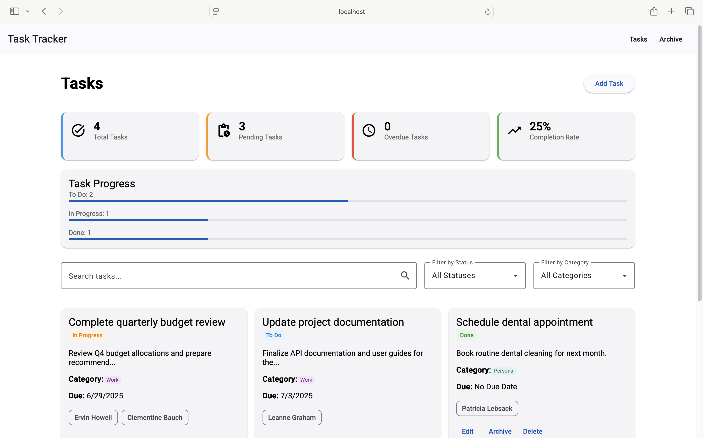
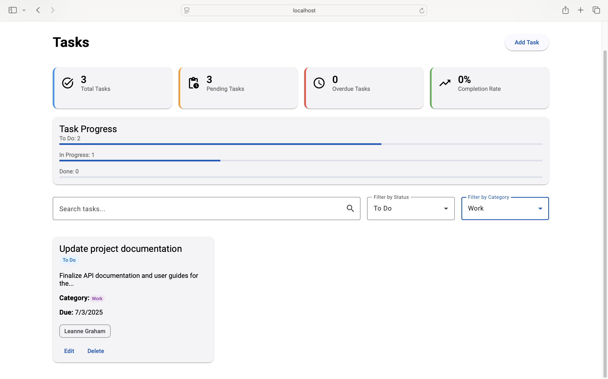
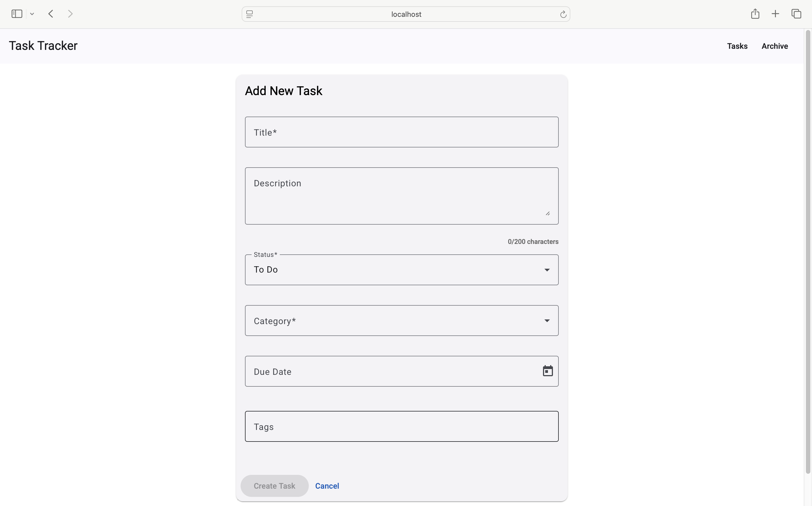
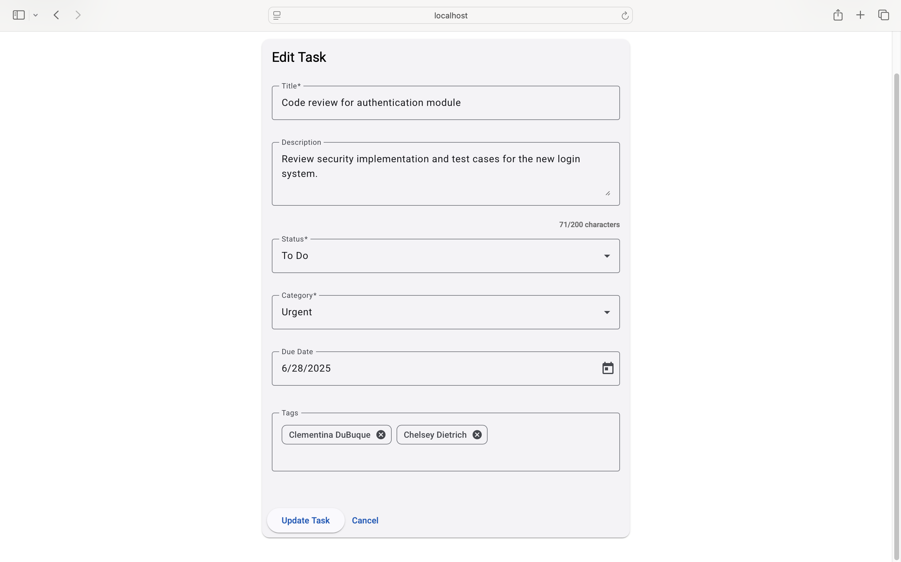
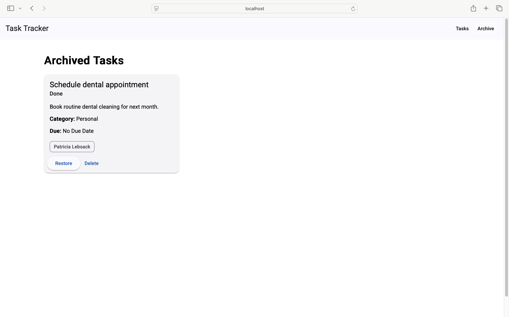

# Task Tracker Application

A modern and responsive task management application developed to demonstrate advanced frontend development skills. The project meets all specified assessment requirements and extends functionality with features such as dynamic filtering, a real-time analytics dashboard, API-driven tagging, and a refined user experience optimized for both desktop and mobile environments.

---

## Overview

The Task Tracker App enables users to create, manage, track, and organize their daily tasks efficiently. It features reactive forms, in-memory data management, custom pipes, directives, and a dashboard UI — all optimized for mobile and desktop usage.

---

## Core Features

- **Task Management (CRUD)**
  - Create, read, update, delete tasks.
  - Archive and restore completed tasks.

- **Dynamic Form Validation**
  - Validations for title, description, category, due date, tags.
  - Custom validators for tags and due date restrictions.

- **Routing & Navigation**
  - `/tasks`: Task list.
  - `/task/:id`: Task detail and edit view.
  - `/archive`: Archived tasks.

- **Dashboard & Stats**
  - Real-time task status summary: Total, Pending, Overdue, Completed.
  - Task progress bars and completion rate display.

- **Search & Filtering**
  - Search tasks by title or description.
  - Filter by status and category.

- **Tags via API**
  - Fetch predefined tags from JSONPlaceholder API.
  - Support custom user-defined tags.
  - API failure handling and local caching.

---

## Additional Enhancements

- **Custom Pipes**
  - `dueDateFormat`: Formats due dates (overdue label, MM/DD/YYYY).
  - `truncate`: Truncates task description to 50 characters.

- **Custom Directives**
  - `appOverdueHighlight`: Highlights overdue tasks with red borders.

- **Responsive UI**
  - Built with Angular Material and responsive breakpoints.
  - Touch-friendly and accessible layout for mobile users.

---

## Technical Stack

- **Framework**: Angular 19
- **UI Library**: Angular Material
- **Forms**: Reactive Forms with custom validators
- **State**: RxJS Observables and Services
- **API**: JSONPlaceholder
- **Tooling**: Angular CLI

---

### Project Structure

```
src/
├── app/
│   ├── components/        # TaskList, TaskForm, TaskDetail, Archive
│   ├── services/          # TaskService, TagService
│   ├── pipes/             # dueDateFormat, truncate
│   ├── directives/        # appOverdueHighlight
│   ├── models/            # Task interface
│   └── app-routing.module.ts
└── assets/
```


---

## Installation & Setup

To run this project locally:

bash
```bash
    git clone https://github.com/chandanpreet707/angular-task-tracker.git
    cd angular-task-tracker
    npm install
    ng serve
```
---

## Validation Summary
| Field  | Rules  |
| ------------ | ------------ |
| Title  | Required, 3–50 characters  |
| Description  | Optional, max 200 characters  |
| Status |  Required, one of: To Do, In Progress, Done |
| Due Date  | Optional, must not be in the past  |
| Category  |  Required, one of: Work, Personal, Urgent, Other |
| Tags  |  Optional, max 5 tags, each 2–20 characters |
---
## Best Practices Followed
- Feature-based folder structure
- Angular Style Guide conventions
- Reusable components, pipes, and directives
- Lazy-loaded routes for performance
- Graceful API error handling and fallback UI
- Cached API responses using RxJS `BehaviorSubject`
---
## Screenshots
### Task Management Dashboard
---

### Search Filters
---

### Task Creation
---

### Task Editing
---

### Archive Management
---

---

### Demo

Watch a full walkthrough of the application:

[Click here to view the demo](https://your-demo-link.com)

### Contact

**Chandanpreet Singh**  
[https://chandanpreet.com/#contact](https://chandanpreet.com/#contact)


